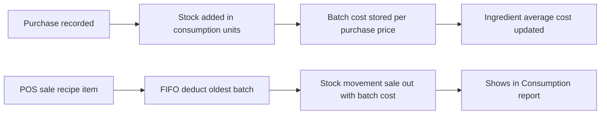
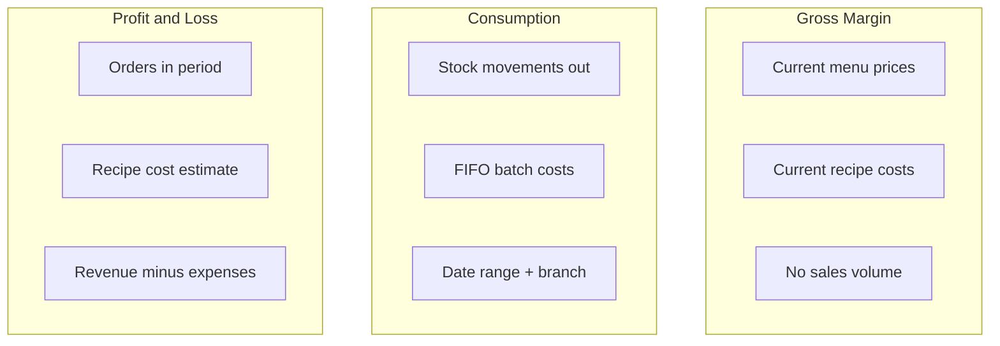

# FoodPOS — Inventory & Reports Guide

This document explains **how inventory and costing work in FoodPOS**, and **what the main reports show**. Use it for demos, onboarding, and client conversations.

---

## 1. Big picture

FoodPOS tracks two kinds of stock:

| Type | What it is | Example |
|------|------------|---------|
| **Ingredients** | Raw materials used in recipes | Flour, chicken, oil |
| **Finished goods (single items)** | Items sold as-is, not built from a recipe | Bottled drink, packaged snack |

**Recipe-based menu items** (burgers, curries, etc.) do **not** hold their own stock. When you sell them, the system **deducts ingredients** from the recipe.

**Deals / combos** are priced as one line on the bill. When sold, FoodPOS **expands the deal’s linked menu items** and deducts stock the same way as selling those items individually (ingredients for recipes, finished-goods stock for singles). Consumption and stock movements follow those deductions. Profit & Loss deal cost still uses the linked items’ recipe/cost estimate.

---

## 2. Setup: purchase unit vs consumption unit (ingredients)

Each ingredient has:

- **Purchase unit** — how you buy (e.g. 1 bag, 1 kg)
- **Consumption unit** — how recipes and stock are tracked (e.g. gram, ml)
- **Conversion rate** — how many consumption units are in **1 purchase unit**  
  Example: 1 bag = 20,000 g → conversion rate = 20,000

When you enter a **purchase price** on the ingredient (e.g. Rs 2,000 per bag), the system calculates:

```
cost per consumption unit = purchase price ÷ conversion rate
                         = 2,000 ÷ 20,000 = Rs 0.10 per gram
```

That **cost per unit** is used in recipes and in several reports.

---

## 3. Purchases — how stock and cost increase

When you record a **purchase**:

### Ingredients

1. You enter quantity in **purchase units** and **price per purchase unit**.
2. The system converts to **consumption units** (qty × conversion rate) and adds to **branch stock**.
3. Each purchase can create or add to a **price batch** — if you buy the same ingredient at a **different price**, it is kept as a **separate batch** (for accurate costing when stock is used).
4. The ingredient’s master **cost per unit** is updated to a **weighted average** of all batches currently in stock:
   ```
   weighted average = sum(qty × batch cost) ÷ sum(qty)
   ```
5. **Purchases do not appear in the Consumption report** — they are stock **in**, not **out**.

### Single (finished) menu items

1. You can only purchase menu items marked as **single type** with **track inventory** on.
2. Stock is added in **pieces** to **menu item stock** batches (with optional expiry).
3. Batch cost = **unit price on the purchase line**.
4. The menu item's **cost price** is updated to a **weighted average** of all in-stock batches after each purchase or sale (same idea as ingredients).
5. Set **Low stock alert (pieces)** on the menu item to get dashboard and inventory warnings when on-hand qty is low.
6. **Gross Margin** and **Profit & Loss** use the menu item's stored cost (kept in sync with stock average).

---

## 4. Sales (POS) — how quantity decreases

When an order is **completed/paid** at POS, inventory is finalized:

### Recipe menu item (e.g. burger)

1. System loads the recipe (including variant-specific recipe if configured).
2. For each ingredient (with **track stock = yes**):
   - Required qty = recipe qty × order qty (includes **waste %** on the recipe).
   - Units are converted to the ingredient’s consumption unit.
3. Stock is deducted using **FIFO** (first in, first out):
   - Oldest restock batch is used first.
4. A **stock movement** is recorded: type **sale**, movement **out**, with **unit cost = that batch’s cost**.

### Single menu item (e.g. Coke)

1. System checks total pieces available at the branch.
2. On sale, deducts from **menu item stock** batches using **FIFO by expiry date** (soonest expiry first).
3. Records a **stock movement** with **unit cost = batch purchase price** (or menu item cost if batch price is missing).

### Add-ons

- **Single add-on** (linked product): deducts that product’s stock like a single menu item.
- **Recipe add-on**: deducts ingredients like a recipe item.
- Add-ons with **track inventory** off: no stock impact.

### Deals

- Selling a deal **expands linked menu items** and deducts their stock (recipe ingredients and/or single-item stock), including pivot quantities (e.g. 2 drinks in a combo).
- POS checks component stock before checkout the same way as selling those items alone.
- Refunds with restock reverse deal component deductions.

### What POS checks before sale

- Recipe items: enough **ingredient** stock (available = on hand minus reserved).
- Single items: enough **piece** stock.
- Deals: enough stock for **each linked component** × deal quantity.

---

## 5. Cost — purchase price, average, and FIFO (plain language)

Clients often ask: *“Is cost based on last purchase or average?”*

| Where | What cost means |
|-------|-----------------|
| **Ingredient master (`cost per unit`)** | **Weighted average** of all in-stock batches after purchases. Used in **recipes** and **Gross Margin / P&L** recipe costing. |
| **Branch stock batch** | **Cost per consumption unit for that specific purchase price**. When stock is sold, FIFO uses **this batch’s cost**, not necessarily today’s average. |
| **Menu item master (`cost`)** | **Weighted average** of all in-stock batches after purchases/sales. Used in **Gross Margin / P&L** for single items. |
| **Menu item stock batch** | **Unit price from the purchase** that created that batch. |
| **Consumption report** | **Actual batch cost at time of use** (from stock movements) — closest to “what did this usage cost us in inventory terms”. |
| **Profit & Loss (food cost)** | **Theoretical cost** from **current** recipes and ingredient costs at report time — **not** the same as Consumption. |

**Short demo line:**

> “When you buy, we update average cost on the ingredient. When you sell, we consume the **oldest stock first** and use **that batch’s price** for the Consumption report. Profit & Loss uses **today’s recipe cost** to estimate margin on sales.”

---

## 6. Manual adjustments

**Inventory → Adjustment** lets you increase or decrease stock (damage, count correction, spoilage, etc.).

- **Ingredients**: adjusts branch stock; logs **adjustment out/in** in stock movements.
- **Single menu items**: adjusts piece stock; also logged.
- **Recipe menu items**: adjust the **ingredients**, not the finished dish row.

Adjustments with **quantity out** appear in the **Consumption report** under **From adjustments**.

---

## 7. Refunds

- **Single items**: stock can be added back to batches (physical restock).
- **Recipe items / deals**: restock is limited in the refund flow; do not assume ingredients always return to stock on refund.
- Consumption and P&L handle refunds differently — see report sections below.

---

## 8. Reports — what to tell clients

All date-based reports use the **branch timezone**. Filters: **branch**, **from date**, **to date** (inclusive).

---

### 8.1 Gross Margin

**What it is:** A **menu pricing tool**, not a sales report.

**Shows (per menu item, today):**

| Column | Meaning |
|--------|---------|
| Sale price | Current menu price |
| Cost | Recipe items: sum of ingredient costs from **default recipe**. Single items: stored cost (auto-synced from stock average). |
| Margin | Price − cost |
| Margin % | Margin ÷ price |

**Does NOT include:**

- No date range (snapshot **now**)
- No branch filter
- No sales quantity
- No deals, add-ons, or variant-specific recipes (uses **base/default** recipe only)

**Demo line:**

> “This helps you spot items priced too low or recipes that need updating before you change the menu. It’s ‘what would I make if I sold one at today’s price and today’s ingredient costs’.”

**Watch for:** **Stale cost** count — recipe items where live-calculated cost differs from stored cost on the menu item.

---

### 8.2 Consumption

**What it is:** **How much inventory left the building** in the period and **what you paid for it** (inventory cashflow view).

**Data source:** Stock **out** movements — mainly **sales** and **manual adjustments** (and waste when used).

**Summary cards:**

| Card | Meaning |
|------|---------|
| **Total consumption value** | Sum of (qty used × unit cost) for all items |
| **From sales** | Used because of completed orders |
| **From adjustments** | Manual reductions, spoilage corrections, etc. |
| **Items** | Count of distinct ingredients / menu items with usage |

**Table columns:**

- **Type** — Ingredient or Menu item  
- **Qty used** — Total consumption units / pieces  
- **Avg unit cost** — Total cost ÷ qty (blended across batches in the period)  
- **Total cost** — **Inventory value consumed** — good for “how much stock worth did we use this month?”

**Does NOT include:**

- Purchases (stock in)
- Items with tracking turned off
- Revenue or profit (cost only)

**Demo line:**

> “If you spent Rs 500,000 on ingredients this month and Consumption shows Rs 380,000 used, that’s the **value of stock that went out** — mainly from sales and adjustments. It uses **actual batch costs** (FIFO), not today’s recipe estimate.”

**Important:** Only items that **write stock movements** appear. Single-item sales and recipe ingredient usage are included; untracked items are not.

---

### 8.3 Profit & Loss

**What it is:** A **period income statement** — did the business make money?

**You must click “Generate report”** — it does not auto-calculate on page load.

**Structure:**

```
Net sales        (subtotal − discounts − refunds, before tax)
− COGS           (estimated food cost on sold items)
= Gross profit
− Operating expenses (recorded expenses + certain cash out transactions)
= Net profit
```

**Revenue notes:**

- Uses order **subtotal** — **tax is excluded**
- Includes non-cancelled orders in the date range (not only “completed” in kitchen sense)
- Refunds reduce revenue by **refund date**, not original sale date

**COGS (food cost) notes:**

- **Estimated** from **current** recipes and ingredient costs when you run the report
- **Variant recipes** are respected on order lines
- **Deals**: cost = sum of linked menu item costs in the deal
- **Add-ons**: **not** included in COGS today
- Lines with **zero cost** are flagged — COGS may be understated

**Operating expenses:**

- From **Expenses** (by expense date) and **Transactions** (money out, grouped by account)
- **Supplier payments / inventory purchases are NOT operating expenses here** — buying stock is not the same as P&L expense in this report

**Demo line:**

> “P&L answers: ‘Did we earn more than we spent on food and running costs this month?’ Food cost is an **estimate from recipes**, not your supplier invoices. For **actual inventory used**, use **Consumption**.”

---

## 9. Side-by-side — which report for which question?

| Client question | Best report |
|-----------------|-------------|
| “Is my burger priced correctly?” | **Gross Margin** |
| “How much stock value did we use this month?” | **Consumption** |
| “Did we make profit this month?” | **Profit & Loss** |
| “What did we pay suppliers?” | **Purchases / supplier payments** (not Consumption) |
| “Actual vs estimated food cost?” | **Consumption** (actual FIFO) vs **P&L** (recipe estimate) |

---

## 10. Common demo talking points (honest limitations)

1. **Deals do not reduce stock** — only reporting cost in P&L; kitchen inventory for combo components is not auto-deducted.
2. **Gross Margin ≠ Profit & Loss margin** — one is catalog snapshot, the other is real sales in a period.
3. **Consumption ≠ P&L COGS** — different cost methods (FIFO movements vs current recipe cost).
4. **Tax** is excluded from P&L revenue.
5. **Add-ons** affect Consumption if tracked; **not** included in P&L food cost yet.
6. **Set conversion rate correctly** on ingredients — wrong rate breaks purchase qty, cost per unit, and reports.
7. **Track inventory** must be on for menu items / ingredients you want in stock checks and Consumption.
8. **Purchases** increase stock and update average cost; they never appear as “consumption”.

---

## 11. Simple flow diagrams

### From purchase to sale (ingredient)



### Three reports at a glance



---

## 12. Glossary

| Term | Meaning in FoodPOS |
|------|---------------------|
| **Consumption unit** | Smallest unit for recipes and ingredient stock (g, ml, pcs) |
| **Purchase unit** | Unit on supplier invoice (bag, kg, carton) |
| **Conversion rate** | Consumption units per 1 purchase unit |
| **FIFO** | First In, First Out — oldest stock batch used first |
| **Batch** | A slice of stock bought at one price (and expiry for finished goods) |
| **COGS** | Cost of goods sold — food cost on sold items |
| **Stock movement** | Ledger row when inventory goes in/out (sales, adjustments) |
| **Track inventory** | Menu item or add-on participates in stock checks and deductions |
| **Track stock** | Ingredient participates in stock checks and deductions |

---

*Last updated from application logic as of July 2026. For internal technical file references, see `InventoryService`, `PurchaseService`, `IngredientCostService`, `GrossMarginReport`, `ConsumptionReport`, and `ProfitLossReport`.*
